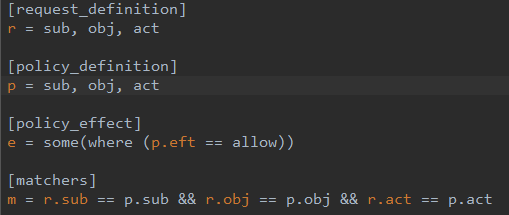
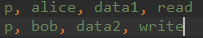
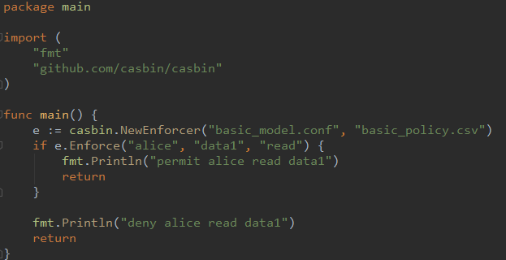

# casbin研究

casbin是一套支持多模型的权限校验系统，拥有丰富的特性。如：

- 基于模型和策略的方式描述规则。
- 提供预定义的`{subject, object, action}`的策略定义方式以及自定义的方式。
- 支持`ACL模型`，`ABAC模型`，`RBAC模型`。
- 提供多种预定义的判断函数，如：`KeyMatch`，`KeyMatch2`，`RegexMatch`和`IPMatch`等。

casbin提供多种语言实现，如golang(casbin)、java(jCasbin)、javascript(node-Casbin)、
php(PHP-Casbin)等。

casbin的使用过程一般为：

1. 定义model和policy，其中policy可以存储在数据库中。
2. 根据model和policy对象，创建校验对象。
3. 使用校验对象对请求进行校验。

事例如下：

- model定义

    

- policy定义

    

- 使用方法

    

那么casebin运行的背后逻辑是什么，数据结构是什么，处理过程是什么呢？
casbin可以简单的理解为，
[govaluate](https://github.com/Knetic/govaluate)和权限判断模型追踪的适配层。
casbin通过自己设计的DSL，定义权限规则，然后解析成相关符号并借助govaluate执行。

## 数据结构

casbin的核心数据结构是`Assertion`，Assertion存储了casbin的model和policy信息。
casbin的核心数据结构及说明如下：

```go
// casbin的入口结构，包含组件的一些配置信息。
type Enforcer struct {
    modelPath string // 模型存储路径
    model model.Model // map[string]map[string]*Assertion
    fm model.FunctionMap // map[string]govaluate.ExpressionFunction
    eft effect.Effector // 描述请求的规则校验结果，用于得出最后的结果
    adapter persist.Adapter // 策略的文件io
    watcher persist.Watcher // 策略的监控，类似linux的inotify的作用
    rm rbac.RoleManager // 处理角色之间的依赖关系
    enabled bool // 是否打开判断
    autoSave bool
    autoBuildRoleLinks bool
}

// model定义和policy定义，解析之后存储的地方。
type Assertion struct {
    Key string // model或policy定义的key，可能为r,p,e,m,g等
    Value string // model或policy定义的字符串值，例如sub, obj, act
    Tokens []string // 存储模型定义中的相关符号
    Policy [][]string // 存储策略定义中的相关符号
    RM rbac.RoleManager // 角色关系管理
}

// RBAC模型中的角色信息存储和部分配置。
type RoleManager struct {
    allRoles *sync.Map // 存储所有角色信息，map[string]*Role
    maxHierarchyLevel int // 角色树的高度
    hasPattern bool // 和matchingFunc组合使用，判断是否设置了匹配函数
    matchingFunc MatchingFunc // 角色名称匹配时的函数，因为sync.Map的Range函数需要
}

// RBAC模型中的角色，一个基本的树结构。
type Role struct {
    name  string // 角色名，结构为domain::group
    roles []*Role // 该角色的直系子角色
}
```

## 执行逻辑

casbin在基础的`Enforcer`的基础上又扩展了`CachedEnforcer`和`SyncedEnforcer`，
但是其最为基础和重要的还是`Enforcer`。
在执行逻辑中，核心部分即为`Enforcer`的实例化以及权限规则判断的`Enforce`方法。

`Enforcer`的实例化流程为：

1. 调用`NewEnforcer`方法，并传入相关参数(此处参数量不定)。
2. 解析参数中的最后一个，根据其值设定`Enforcer`是否使用日志记录功能。
3. 除去最后一个参数，若还剩两个参数，则将第一个确认为model定义，第二个确认为policy定义；
若还剩一个参数，则将该参数确认为model定义，对于policy的定义则为空。若还剩零个参数，
则model和policy的定义都为空。
4. 接着解析model定义，根据`r, p, e, m, g`标志读取相关信息并将各个对应的值解析成符号。
针对上面的示例，解析出来的结果如下：

    - r = sub, obj, act

        ```go
        {
            Key: "r",
            Value: "sub, obj, act",
            Tokens: {"r_sub", "r_obj", "r_act"},
            Policy: nil,
            RM: nil,
        }
        ```

    - p = sub, obj, act

        ```go
        {
            Key: "p",
            Value: "sub, obj, act",
            Tokens: "p_sub, p_obj, p_act",
            Policy: {
                {"alice", "data1", "read"},
                {"bob", "data2", "write"}
            }
        }
        ```

    - e = some(where (p_eft == allow))

        ```go
        {
            Key: "e",
            Value: "some(where (p_eft == allow))",
            Tokens: nil,
            Policy: nil,
            RM: nil,
        }
        ```

    - m = r_sub == p_sub && r_obj == p_obj && r_act == p_act

        ```go
        {
            Key: "m",
            Value: "r_sub == p_sub && r_obj == p_obj && r_act == p_act",
            Tokens: nil,
            Policy: nil,
            RM: nil,
        }
        ```

    - g = _,_,_,_

        ```go
        {
            Key: "g",
            Value: "_,_,_,_",
            Tokens: nil,
            Policy: nil,
            RM: nil,
        }
        ```

5. 载入规则中的预定义功能函数，包括：`keyMatch`、`keyMatch2`、`regexMatch`、`ipMatch`。
6. 创建默认的角色管理和结果校验对象，即`RoleManager`和`Effector`。
7. 解析policy的定义，解析出来的结果参考上面**p**的Policy部分。
8. 解析角色并处理角色之间的关系。
9. 返回`Enforcer`对象，完成实例化过程。

规则判断的`Enforce`流程：

1. 判断是否启动`Enforcer`，若否则直接通过，否则进行判断。
2. 将`Enforcer`中的`rm`和`g`，生成`govaluate.ExpressionFunction`。
3. 获取model定义中的`m`部分并结合之前解析出的表达式函数符号，
生成一个`govaluate.EvaluableExpression`。
4. 将model中的`r`和`p`的Token部分和请求的描述信息一起组合成为待执行校验表达式的参数。
最后参数的形式如下：

    ```go
    {
        rTokens: {
            r_sub: 0,
            r_obj: 1,
            r_act: 2,
        },
        rVals: {
            "alice", "data1", "read"
        },
        pTokens: {
            p_sub: 0,
            p_obj: 1,
            p_act: 2
        },
        pVals: {
            "alice", "data1", "read"
        },
    }
    ```

    > 上述的pTokens和pVals，rTokens和rVals就是一种规则对应，按位置取值的无奈之举。

5. 对model中的`p`的Policy部分进行遍历，并结合之前的参数和表达式一起执行获取结果，
存储到`Effector`的数组之中。
6. 根据model中的`m`值，结合之前的每一个Policy的校验结果，合并为最终一个规则。
得到最终结果——请求是否符合规则。

    > model中的`m`的值有：
    >
    >   - some(where (p_eft == allow))，一个为true即为true
    >   - !some(where (p_eft == deny))，一个为false即为false
    >   - some(where (p_eft == allow)) && !some(where (p_eft == deny))，
    存在false就为false
    >   - priority(p_eft) || deny，最后一个为false就为false

## 参考资料

- [govaluate](https://github.com/Knetic/govaluate)
- [casbin](https://github.com/casbin/casbin)
- [ACL](https://en.wikipedia.org/wiki/Access-control_list)
- [RBAC](https://en.wikipedia.org/wiki/Role-based_access_control)
- [ABAC](https://en.wikipedia.org/wiki/Attribute-based_access_control)
