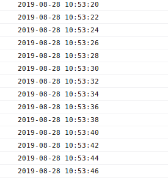
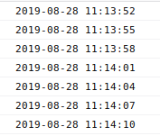
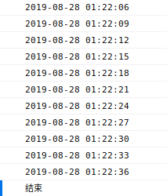
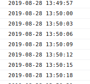

# web双向通信技术方案

传统的C/S架构的web通信，只能由C向S请求数据，而不能由S向C发送数据。
也就是说，传统的C/S架构的web通信是很难实现数据的双向通信的。
然而，现实中很多场景需要使用web的数据双向通信。
例如，即使通信，客户在登录浏览器端之后需要及时的接收到其他人发送给他的消息。
还有目前使用比较多的二维码登录，用户在手机端扫码之后，其他端需要及时的登录成功，
即服务器需要通知其他客户端，用户登录成功了。

目前实现web双向通信的方案主要有：

- Ajax短轮询。
- Comet技术。
- WebSocket协议。

## Ajax短轮询

ajax短轮询，通过浏览器端定时请求服务器端数据，模拟实现双向数据通信。
但是，该方案有着明显的缺点，如：

- 需要一直请求数据，占用带宽。
- 浏览器端需要一直执行循环，占用计算资源。
- 通过客户端定时请求来模拟，服务器端主动发送数据，存在着数据延迟。

一般在显示环境中，不建议使用这种方案。该方案核心代码如下：

```html
<!DOCTYPE html>
<html lang="en">
<head>
    <meta charset="UTF-8">
    <title>Ajax Loop</title>
    <script src="https://cdn.bootcss.com/jquery/3.4.1/jquery.min.js"></script>
</head>
<body>
<script type="text/javascript">
    setInterval(function () {
        $.post("http://127.0.0.1:1335/msg", function (data) {
            console.log(data);
        });
    }, 2 * 1000);
</script>
</body>
</html>
```

```go
package main

import (
    "html/template"
    "log"
    "net/http"
    "time"
)

func main() {
    http.HandleFunc("/", index)
    http.HandleFunc("/msg", printMsg)
    err := http.ListenAndServe("127.0.0.1:1335", nil)
    if err != nil {
        log.Fatal(err)
    }
}

func printMsg(w http.ResponseWriter, req *http.Request) {
    if req.Method != http.MethodPost {
        http.Error(
            w, "必须为POST请求", http.StatusMethodNotAllowed,
        )
        return
    }

    _, err := w.Write([]byte(time.Now().Format("2006-01-02 15:04:05")))
    if err != nil {
        http.Error(
            w, err.Error(), http.StatusInternalServerError,
        )
    }
    return
}

func index(w http.ResponseWriter, req *http.Request) {
    if req.Method != http.MethodGet {
        http.Error(
            w, "必须为GET请求", http.StatusMethodNotAllowed,
        )
        return
    }

    tpl, err := template.ParseFiles("index.html")
    if err != nil {
        http.Error(
            w, err.Error(), http.StatusInternalServerError,
        )
        return
    }

    err = tpl.Execute(w, nil)
    if err != nil {
        http.Error(
            w, err.Error(), http.StatusInternalServerError,
        )
    }
    return
}
```

运行结果如下：



## Comet技术

Comet技术有两种实现方案：

- 基于ajax的长轮询（long-polling）方式。
- 基于iframe和htmlfile的流方式。

### ajax的long-polling方式

基于ajax的long-polling方式，基本上类似于ajax的短轮询。主要区别在于：

- 服务器端会阻塞请求直到有数据传递或者超时才返回。
- 客户端JavaScript影响处理函数会在处理完服务器返回的信息后，再次发送请求，重新建立连接。
- 当客户端处理接受的数据、重新建立连接时，服务器可能有新的数据到达；这些数据会被服务器保存
直到客户端重新建立连接，客户端会一次把所有当前服务器端的所有信息取回。

该方案的核心代码如下：

```html
<!DOCTYPE html>
<html lang="en">
<head>
    <meta charset="UTF-8">
    <title>Long Polling</title>
    <script src="https://cdn.bootcss.com/jquery/3.4.1/jquery.min.js"></script>
</head>
<body>
<script type="text/javascript">
    (function post() {
        $.post("http://127.0.0.1:1335/msg", function (data) {
            console.log(data);
            post();
        });
    })();
</script>
</body>
</html>
```

```go
package main

import (
    "html/template"
    "log"
    "net/http"
    "time"
)

var dateChan chan string

func init() {
    dateChan = make(chan string, 10)
}

func main() {
    go makeMsg()

    http.HandleFunc("/", index)
    http.HandleFunc("/msg", printMsg)

    err := http.ListenAndServe("127.0.0.1:1335", nil)
    if err != nil {
        log.Fatal(err)
    }
}

func printMsg(w http.ResponseWriter, req *http.Request) {
    if req.Method != http.MethodPost {
        http.Error(
            w, "必须为POST请求", http.StatusMethodNotAllowed,
        )
        return
    }

    timeout := time.NewTimer(30 * time.Second)
    for {
        select {
        case <-timeout.C:
            w.WriteHeader(http.StatusOK)
            return
        case i := <-dateChan:
            _, err := w.Write([]byte(i))
            if err != nil {
                http.Error(
                    w, err.Error(), http.StatusInternalServerError,
                )
                return
            }
            return
        }
    }
}

func makeMsg() {
    ticker := time.NewTicker(3 * time.Second)
    for {
        select {
        case <-ticker.C:
            dateChan <- time.Now().Format("2006-01-02 15:04:05")
        }
    }
}

func index(w http.ResponseWriter, req *http.Request) {
    if req.Method != http.MethodGet {
        http.Error(
            w, "必须为GET请求", http.StatusMethodNotAllowed,
        )
        return
    }

    tpl, err := template.ParseFiles("index.html")
    if err != nil {
        http.Error(
            w, err.Error(), http.StatusInternalServerError,
        )
        return
    }

    if err = tpl.Execute(w, nil); err != nil {
        http.Error(
            w, err.Error(), http.StatusInternalServerError,
        )
        return
    }
}

```

运行结果如下：



### iframe的htmlfile流方式

iframe是很早就存在的一种HTML标记，通过在HTML页面里嵌入一个隐蔵帧，
然后将这个隐蔵帧的`SRC`属性设为对一个长连接的请求，服务器端就能源源不断地往客户端输入数据。

iframe方案有两个要点：

- 服务器端接口不在返回数据，而是返回一个包含数据的JavaScript函数调用。
- 服务器端接口将数据以`Transfer-Encoding: chunked`的分片流式方式传输。

使用iframe方案，存在着一个明显的不足就是，浏览器的进度条会一直在旋转。
核心代码如下：

```html
<!DOCTYPE html>
<html lang="en">
<head>
    <meta charset="UTF-8">
    <title>iframe</title>
    <script src="https://cdn.bootcss.com/jquery/3.4.1/jquery.min.js"></script>
    <script type="text/javascript">
        function printMsg(data) {
            console.log(data)
        }
    </script>
</head>
<body>
<iframe src="http://127.0.0.1:1355/msg">
</iframe>
</body>
</html>
```

```go
package main

import (
    "fmt"
    "html/template"
    "log"
    "net/http"
    "time"
)

var dateCh chan string

func init() {
    dateCh = make(chan string, 10)
}

func main() {
    go makeMsg()

    http.HandleFunc("/", index)
    http.HandleFunc("/msg", printMsg)

    err := http.ListenAndServe("127.0.0.1:1355", nil)
    if err != nil {
        log.Fatalln(err)
    }
}

func printMsg(w http.ResponseWriter, req *http.Request) {
    if req.Method != http.MethodGet {
        http.Error(
            w, "必须使用GET方法", http.StatusMethodNotAllowed,
        )
        return
    }

    timeout := time.NewTimer(30 * time.Second)
    for {
        select {
        case <-timeout.C:
            w.WriteHeader(http.StatusOK)
            _, err := w.Write([]byte(
                `<script type="text/javascript">parent.printMsg("结束");</script>`,
            ))
            if err != nil {
                http.Error(
                    w, err.Error(), http.StatusInternalServerError,
                )
            }
            return
        case i := <-dateCh:
            flusher, ok := w.(http.Flusher)
            if !ok {
                http.Error(
                    w, "无法转换为flusher", http.StatusInternalServerError,
                )
                return
            }
            ret := fmt.Sprintf(
                `<script type="text/javascript">parent.printMsg("%s");</script>`,
                i,
            )
            _, err := w.Write([]byte(ret))
            if err != nil {
                http.Error(
                    w, err.Error(), http.StatusInternalServerError,
                )
                return
            }
            flusher.Flush()
        }
    }
}

func makeMsg() {
    ticker := time.NewTicker(3 * time.Second)
    for {
        select {
        case <-ticker.C:
            dateCh <- time.Now().Format("2006-01-02 15:04:05")
        }
    }
}

func index(w http.ResponseWriter, req *http.Request) {
    if req.Method != http.MethodGet {
        http.Error(
            w, "必须使用GET方法", http.StatusMethodNotAllowed,
        )
        return
    }

    tpl, err := template.ParseFiles("index.html")
    if err != nil {
        http.Error(
            w, err.Error(), http.StatusInternalServerError,
        )
        return
    }

    if err = tpl.Execute(w, nil); err != nil {
        http.Error(
            w, err.Error(), http.StatusInternalServerError,
        )
        return
    }
}

```

运行结果如下：



## WebSocket协议

WebSocket协议是新一代的web双向通信技术，通过保持连接打开，实现数据的双向传输。
WebSocket协议工作在OSI模型的应用层，将`ws`和`wss`定义为两个新的统一资源标识符方案，分别对应
明文和加密连接。除了方案名称和片段ID（不支持`#`）之外，其余的URI组件都被定义为此URI的通用语法。

WebSocket协议拥有以下有点：

- 较少的控制开销。
- 更强的实时性。
- 保持连接状态。
- 更好的二进制支持。
- 可以支持扩展。
- 更好的压缩效果。

WebSocket连接通过`HTTP/1.1`协议的101状态码进行建立。
一个典型的WebSocket握手请求如下：

```text
# 客户端请求
GET / HTTP/1.1
Upgrade: websocket
Connection: Upgrade
Host: example.com
Origin: http://example.com
Sec-WebSocket-Key: sN9cRrP/n9NdMgdcy2VJFQ==
Sec-WebSocket-Version: 13
```

```text
# 服务器响应
HTTP/1.1 101 Switching Protocols
Upgrade: websocket
Connection: Upgrade
Sec-WebSocket-Accept: fFBooB7FAkLlXgRSz0BT3v4hq5s=
Sec-WebSocket-Location: ws://example.com/
```

核心代码如下：

```html
<!DOCTYPE html>
<html lang="en">
<head>
    <meta charset="UTF-8">
    <title>WebSocket</title>
</head>
<body>
<script type="text/javascript">
    let ws = new WebSocket("ws://127.0.0.1:1355/ws");
    ws.addEventListener('open', function () {
        ws.send("Hello World\n");
    });
    ws.addEventListener('message', function (event) {
        console.log(event.data)
    })
</script>
</body>
</html>
```

```go
package main

import (
    "github.com/gorilla/websocket"
    "html/template"
    "log"
    "net/http"
    "time"
)

var dateChan chan string
var wsUpgrader websocket.Upgrader

func init() {
    dateChan = make(chan string, 10)
    wsUpgrader = websocket.Upgrader{
        ReadBufferSize:  1024,
        WriteBufferSize: 1024,
    }
}

func main() {
    go makeMsg()

    http.HandleFunc("/", index)
    http.HandleFunc("/ws", printMsg)

    log.Fatal(http.ListenAndServe("127.0.0.1:1355", nil))
}

func makeMsg() {
    ticker := time.NewTicker(3 * time.Second)
    for {
        select {
        case <-ticker.C:
            dateChan <- time.Now().Format("2006-01-02 15:04:05")
        }
    }
}

func printMsg(w http.ResponseWriter, req *http.Request) {
    conn, err := wsUpgrader.Upgrade(w, req, nil)
    if err != nil {
        http.Error(
            w, err.Error(), http.StatusInternalServerError,
        )
        return
    }

    defer conn.Close()

    for {
        select {
        case msg := <-dateChan:
            err := conn.WriteMessage(websocket.TextMessage, []byte(msg))
            if err != nil {
                log.Println("write:", err)
                return
            }
        }
    }
}

func index(w http.ResponseWriter, req *http.Request) {
    if req.Method != http.MethodGet {
        http.Error(
            w, "必须为GET方法", http.StatusMethodNotAllowed,
        )
        return
    }

    tpl, err := template.ParseFiles("index.html")
    if err != nil {
        http.Error(
            w, err.Error(), http.StatusInternalServerError,
        )
        return
    }

    if err = tpl.Execute(w, nil); err != nil {
        http.Error(
            w, err.Error(), http.StatusInternalServerError,
        )
        return
    }
}
```

运行结果如下：



## 参考资料

- [WebSocket维基百科](https://zh.wikipedia.org/wiki/WebSocket)
- [MDN WebSocket API](https://developer.mozilla.org/zh-CN/docs/Web/API/WebSocket)
- [WebSocket协议说明](https://tools.ietf.org/html/rfc6455)
- [Golang WebSocket库](https://github.com/gorilla/websocket)
