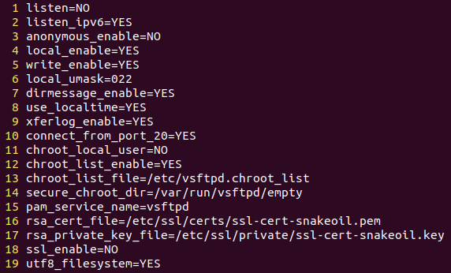
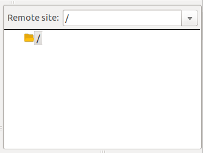
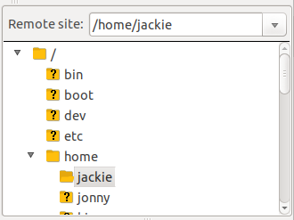
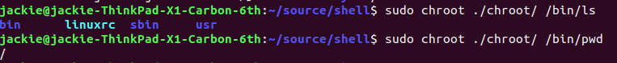
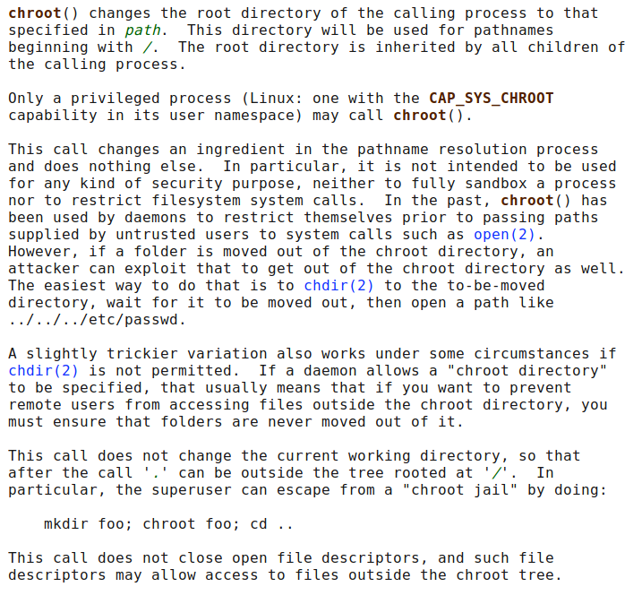

# linux chroot作用和实现原理

linux文件系统以`树`的方式组织数据，其中`树根（根目录）`是整个文件系统的起点，记为`/`。
默认情况下，系统中的用户可以访问整个文件系统，这不仅会造成安全问题，也会给开发带来一定的麻烦。
因为开发时，进程可能会`污染`整个文件系统。严重点，如果代码操作，可能会破坏整个文件系统。

linux通过引入chroot机制，变更进程和子进程的可见根路径。一般使用chroot机制的情况：

- 系统维护问题，例如root密码重置、bootloader安装，initramfs镜像重建
- 程序开发
- 系统安全问题

chroot机制需要以下必要条件：

- root权限
- linux环境
- chroot需要的内核模块
- 如果需要swap，chroot之前需要启用swap
- 如果需要网路，chroot之前需要建立好网络连接

chroot机制的相关命令：

- chroot
- proot
- fakeroot

## chroot的使用实例

chroot的使用场景很多，我们将以`vsftpd`，`chroot命令`和`fakeroot命令`作为介绍。

1. vsftpd中的chroot

    vsftpd是linux下比较常用的ftp服务器，默认情况下系统用户在登录ftp服务器后
    将可以看到整个文件系统的目录。由于安全的原因，vsftpd借助linux的chroot机制，
    将具体每个用户的根目录限定到指定的目录之中。

    下图是我们使用vsftpd测试时的配置：

    

    使用了chroot机制的用户连接后，效果如下：

    

    而未使用chroot机制，则如下：

    

    通过对比，我们可以发现，使用了chroot的vsftpd和未使用的主要区别就表现在根目录上，
    使用了chroot机制的用户，在登录之后根目录则为自己的用户目录，而未使用的用户，则
    依然是系统的根目录。二者在安全性上的区别很明显。

2. chroot命令中的chroot

    此处的chroot指，使用了linux系统的`chroot命令`，而非系统的`chroot机制`。我们可以
    简单的将`chroot机制`理解为`<unistd.h>中的chroot接口`，将`chroot`命令理解为使用
    `chroot机制`的应用。

    `chroot命令`做的事情就是切换进程的根目录，并执行相应的指令。若没有指定指令，则执行
    默认的`$SHELL -i`。

    以busybox为基础，使用chroot的效果如下：

    

    从上图中，我们可以看出根目录结构明显不同于一般的linux操作系统。

从上述两个，chroot机制的实例中，我们可以大致理解chroot通过限制进程的`逻辑根目录`达到进程和
系统的文件系统隔离，为系统本身带来了极高的安全性。

## chroot、proot和fakeroot命令的实现原理

chroot、proot和fakeroot，全部通过使用操作系统的`chroot`接口实现其功能。其主要区别在于，
`proot`和`fakeroot`可以在用户权限下实现根目录的切换，而`chroot命令`则必须使用`root`权限。

`chroot命令`、`proot`和`fakeroot`的背后实现基本一致。从功能上来看，`chroot命令`的实现较
为简单，此处我们也用粗略的代码来实现相似的功能。

核心代码如下：

```c
#include <stdio.h>
#include <unistd.h>
#include <string.h>
#include <errno.h>
#include <stdlib.h>

int main(int argc, char **argv) {
    int ch;
    char *dir = "";
    char *cmd = "";

    while ((ch = getopt(argc, argv, "d:c:")) != -1) {
        switch (ch) {
            case 'd':
                dir = optarg;
                break;
            case 'c':
                cmd = optarg;
                break;
            default:
                printf("-d and -c are must specify\n");
        }
    }

    // 目录是否为空
    if (!strlen(dir)) {
        fprintf(stderr, "chroot directory is empty\n");
        return -1;
    }

    // 命令是否为空
    if (!strlen(cmd)) {
        fprintf(stderr, "command is empty\n");
        return -1;
    }

    int ret;
    ret = chroot(dir);
    if (ret) {
        fprintf(stderr, "chroot: %s\n", strerror(errno));
        return errno;
    }

    ret = chdir("/");
    if (ret) {
        fprintf(stderr, "chdir: %s\n", strerror(errno));
        return errno;
    }

    ret = system(cmd);
    if (ret) {
        fprintf(stderr, "execute %s error: %d\n", cmd, ret);
        return -1;
    }

    return 0;
}
```

执行结果如下：


## chroot接口底层原理

chroot机制通过linux提供的`int chroot(const char *path);`接口实现。
关于`chroot接口`的实现，linux的man pages中给出了大致的说明：



大致理解发现：

- chroot接口通过修改系统对路径的解析，即对以`/`开头的路径的解析过程来限制进程的文件系统。
- chroot不能提供完全的安全性，因为可以通过`../`或`./`这种目录结构，`逃出`限制环境。
- chroot不会修改`pwd`，在使用chroot接口时，需要注意。
- chroot需要`root`权限。

> 对于内核代码层面的chroot实现研究，目前实力限制，尚且做不到。
待后续实力达到，将会补充相关的内容。

## 参考资料

- [Linux chroot API](http://man7.org/linux/man-pages/man2/chroot.2.html)
- [ARCHWiki chroot command](https://wiki.archlinux.org/index.php/Chroot)
- [Wiki Chroot](https://en.wikipedia.org/wiki/Chroot)
