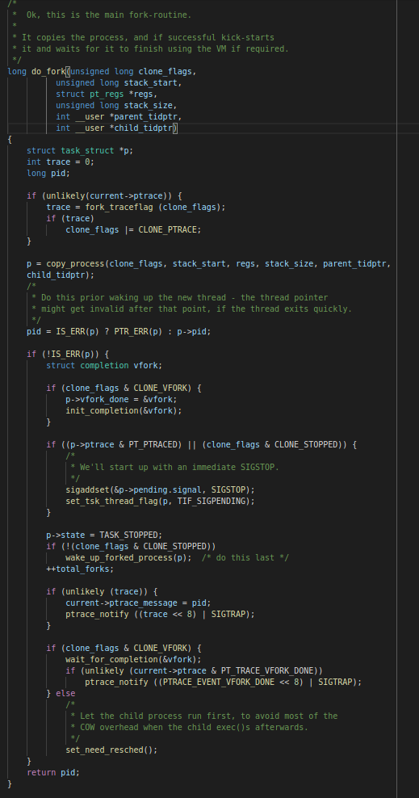

# linux守护进程用法和实现原理

linux后台进程一般称为守护进程(daemon)，是运行在后台的特殊进程。
它独立与控制终端并且周期性地执行某种任务或等待某些事件的发生。
守护进程在服务编程中用的比较多，比如常用的httpd,nginx,apache等。

linux中实现守护进程一般用`fork`或`daemon`系统接口。
daemon接口其实就是对fork的封装，简化用户的调用操作，不过用户同时也难以实现精细控制。
linux系统一般守护进程开发步骤如下：

1. 调用`umask`将文件模式创建屏蔽字设置为一个已知值，一般为0。
2. 调用`fork`，然后使父进程exit。
3. 调用`setsid`创建一个新回话。
4. 将当前目录更改为根目录。
5. 关闭不在需要的文件描述符。
6. 重定向文件描述符`0，1,2`至`/dev/null`。

## fork和daemon的接口使用事例

daemon接口是linux系统对fork的二次封装，本文主要研究fork的使用，以及背后的原因。
其实fork的使用，归根结底还是对linux操作系统的一些相关概念的解释。
事例代码如下：

```c
#include <stdio.h>
#include <unistd.h>
#include <time.h>
#include <fcntl.h>
#include <sys/resource.h>
#include <sys/stat.h>

int main() {
    // 清空文件掩码
    umask(0);

    // fork出子进程
    pid_t pid = fork();
    if (-1 == pid) {
        perror("fork");
        return -1;
    }
    if (pid) {
        return 0;
    } else {
        // 设置会话id
        if (-1 == setsid()) {
            perror("setsid");
            return -1;
        }
    }

    // 切换当前目录至根目录
    if (chdir("/") < 0) {
        perror("chdir");
        return -1;
    }

    // 关闭继承来的文件描述符
    struct rlimit rl;
    if (getrlimit(RLIMIT_NOFILE, &rl) < 0) {
        perror("getrlimit");
        return -1;
    }

    rlim_t nfiles;
    nfiles = rl.rlim_cur > rl.rlim_max ? rl.rlim_max : rl.rlim_cur;
    for (rlim_t i = 3; i < nfiles; ++i) {
        close(i);
    }

    // 将0,1,2三个文件描述符重定向至/dev/null
    int fd;
    if ((fd = open("/dev/null", O_RDWR)) < 0) {
        perror("open");
        return -1;
    }

    dup2(fd, STDIN_FILENO);
    dup2(fd, STDOUT_FILENO);
    dup2(fd, STDERR_FILENO);
}
```

上面的事例代码，大致就是一个守护进程的创建过程。
尽管如下，在现实使用时，我们还需要注意下面几点：

- 守护进程需要处理系统的部分信号。
- 保险起见，我们可能需要两次调用fork，直至守护进程的控制终端完全无法启动。

由于daemon接口是对fork接口的二次封装，故此处就不在做多余介绍。
daemon的使用要比fork简单很多，不过在控制细节和了解背后原理方面则稍微要差一点。

## fork的内核实现原理

`fork`接口从使用效果上来看，有以下几个特点：

- 一个函数，返回两次。
fork函数之所以会返回两次，是因为linux系统将原进程的所有信息，包括执行代码全部拷贝到新进程中。
并且新进程代码的起始执行部分就是fork函数所在的位置。
- 对于父进程，fork返回进程id，对于子进程fork返回0。
linux通过修改fork函数的栈帧来修改fork的返回值，进而做到返回不同的值。

linux内核又是如何实现上述特征的呢？从内核源码中，我们可以发现其秘密。
linux的fork系统调用位于：`kernel/fork.c`。
fork接口的主要函数为：`do_fork()`。
代码如下：



> 代码有点长，屏幕高度不够，所以只能用小字体截屏了。

通过观察内核的代码，大概可以确定，整个fork系统调用，最为核心的有：

- copy_process完成新的内核进程信息建立和复制的过程。
- 设置相关标志以及信号处理。
- set_need_resched设置子进程优先调度。
