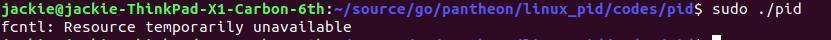

# linux下pid文件的作用和原理

linux下pid文件一般用作后台进程的唯一性标志，防止进程启动多个副本。
只有获得pid文件写入权限(F_WRLCK)的进程才能正常启动，并写入自身pid。

一般实现步骤：

1. 打开pid文件，如果没有则新建。
2. 使用`fcntl`接口，获取pid文件的锁定权限。
3. 向pid文件中，写入进程pid值。

注意事项：

- 如果进程退出了，则该进程加的锁自动失效。
- 如果进程关闭了该文件描述符，则加的锁失效。
- 锁的状态不会被子进程继承，如果进程关闭则锁失效而不管子进程是否在运行。

事例代码：

```c
#include <stdio.h>
#include <fcntl.h>
#include <unistd.h>

int
main()
{
    int fd = open("/var/run/pid.pid", O_RDWR | O_CREAT | O_APPEND);
    if (-1 == fd) {
        perror("open");
        return -1;
    }

    struct flock lk = {
        .l_type = F_WRLCK,
        .l_whence = SEEK_SET,
        .l_start = 0,
        .l_len = 0
    };

    if (-1 == fcntl(fd, F_SETLK, &lk)) {
        perror("fcntl");
        return -1;
    }

    int n;
    char buf[BUFSIZ];
    if ((n = sprintf(buf, "%d\n", getpid())) < 0){
        perror("sprintf");
        return -1;
    }
    if (-1 == write(fd, buf, n)){
        perror("write");
        return -1;
    }
}
```

上述代码测试结果：




## 原理

pid的原理本质上就是linux下的进程间数据同步。
进程通过对指定文件加锁，达到告诉其它同样想操作该文件的进程此文件已经不可用。
更进一步，通过linux系统的`记录锁`机制，可以实现进程的重复启动。

对于linux内核中，如果实现`记录锁`的相关内容，待后续补充。
