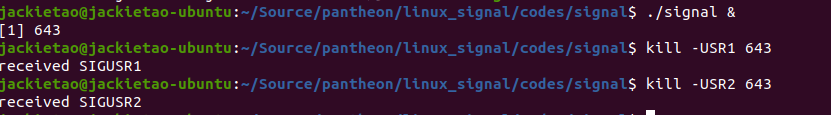
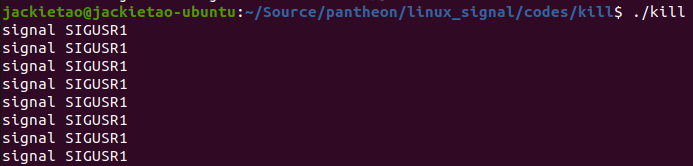
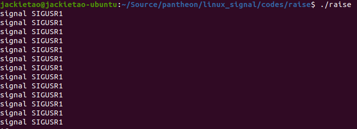
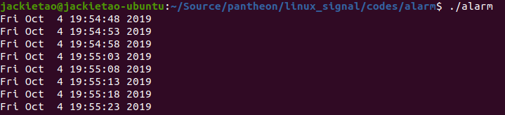

# linux的信号机制

在计算机科学中，信号是Unix、类Unix以及其他POSIX兼容的操作系统中进程间通讯的一种有限制的方式。
它是一种异步的通知机制，用来提醒进程一个事件已经发生。
当一个信号发送给一个进程，操作系统中断了进程正常的控制流程，此时，任何非原子操作都将被中断。
如果进程定义了信号的处理函数，那么它将被执行，否则就执行默认的处理函数。

## 使用方法

linux的api中与信号相关的函数为：

- `void (*signal(int signo, void (*func)(int))) (int)`
- `int kill(pid_t pid, int signo)`
- `int raise(int signo)`
- `unsigned int alarm(unsigned int seconds)`
- `int pause(void);`
- `void abort(void);`

### 信号具体示例

- signal

    ```C
    #include <stdio.h>
    #include <signal.h>
    #include <unistd.h>

    static void
    sig_usr(int signo)
    {
        if (signo == SIGUSR1) {
            printf("received SIGUSR1\n");
        } else if(signo == SIGUSR2) {
            printf("received SIGUSR2\n");
        }

        return;
    }

    int
    main(int argc, char **argv)
    {
        if (signal(SIGUSR1, sig_usr) == SIG_ERR) {
            perror("signal SIGUSR1");
            return 0;
        }
        if (signal(SIGUSR2, sig_usr) == SIG_ERR) {
            perror("signal SIGUSR2");
            return 0;
        }

        for(;;) {
            pause();
        }
    }
    ```

    signal的第一个参数表示信号类别，第二个参数表示信号发生时对应的处理函数。
    该函数可以是常量SIG_IGN(向内核表示忽略次信号，SIGKILL和SIGSTOP则不能忽略)、
    SIG_DFL(表示接受此信号后的动作是系统默认动作)和自定义函数的地址(信号处理程序)。

    执行效果如下：

    

- kill

    `kill`函数将信号发送给进程或进程组。

    ```C
    #include <stdio.h>
    #include <signal.h>
    #include <unistd.h>

    static void
    sig_usr(int signo)
    {
        if (signo == SIGUSR1) {
            printf("signal SIGUSR1\n");
        }
        return;
    }

    int
    main(int argc, char **argv)
    {
        if (signal(SIGUSR1, sig_usr) == SIG_ERR) {
            perror("signal SIGUSR1");
            return -1;
        }

        for (;;) {
            sleep(5);
            kill(getpid(), SIGUSR1);
        }
    }
    ```

    对于kill函数，其pid的值类别不同，处理方式也是不同的。
    linux系统主要处理`pid>0`、`pid==0`、`pid<0`和`pid==-1`的四种情况。

    执行效果如下：

    

- raise

    `raise`函数和`kill`函数基本效果相关，唯一的区别在于前者将信号发给自身，而后者则不是。
    `raise`函数等价于`kill(getpid(), signo)`。

    ```C
    #include <stdio.h>
    #include <signal.h>
    #include <unistd.h>

    static void
    sig_usr(int signo)
    {
        if (signo == SIGUSR1) {
            printf("signal SIGUSR1\n");
        }
        return;
    }

    int
    main(int argc, char **argv)
    {
        if (signal(SIGUSR1, sig_usr) == SIG_ERR) {
            perror("signal SIGUSR1");
            return -1;
        }

        for (;;) {
            sleep(5);
            raise(SIGUSR1);
        }
    }
    ```

    执行效果如下：
    

- alarm和pause

    `alarm`函数可以设置一个定时器，在将来的某个时刻该定时器会超时。
    当定时器超时时，产生SIGALRM信号。
    如果忽略或不捕捉此信号，则默认动作是终止调用该`alarm`函数的进程。
    `pause`函数使调用进程挂起直到捕捉到一个信号。

    ```C
    #include <stdio.h>
    #include <signal.h>
    #include <unistd.h>
    #include <time.h>

    static time_t t;

    static void
    sig_alrm(int signo)
    {
        struct tm *tm_info;
        time(&t);
        tm_info = localtime(&t);
        printf("%s", asctime(tm_info));
    }

    int
    main(int argc, char **argv)
    {
        if (signal(SIGALRM, sig_alrm) == SIG_ERR) {
            perror("signal SIGALRM");
            return -1;
        }

        for (;;) {
            alarm(5);
            pause();
        }
    }
    ```

    执行效果如下：
    

- abort

    `abort`函数的功能是使程序异常终止。此函数将SIGABRT信号发送给调用进程。

    ```C
    #include <stdio.h>
    #include <signal.h>
    #include <unistd.h>
    #include <stdlib.h>

    static void
    sig_abrt(int signo)
    {
        printf("signal SIGABRT handler\n");
        exit(0);
    }

    int
    main(int argc, char **argv)
    {
        if (signal(SIGABRT, sig_abrt) == SIG_ERR) {
            perror("signal SIGABRT");
            return -1;
        }

        abort();
        pause();
    }
    ```

    执行效果如下：
    
