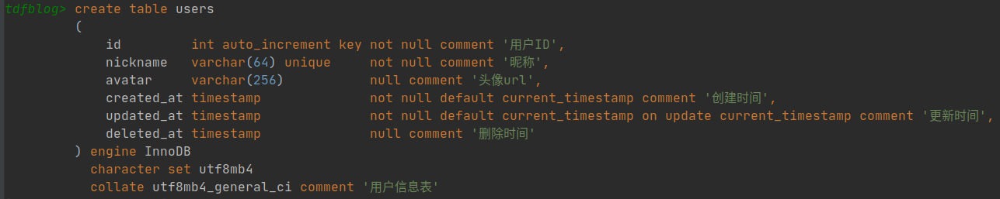
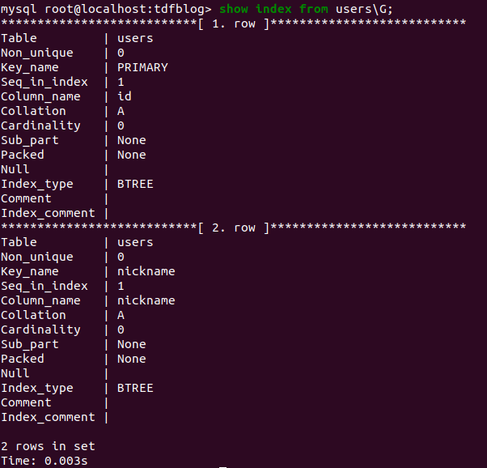
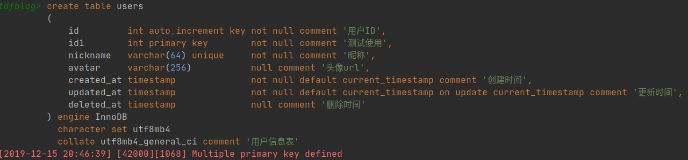
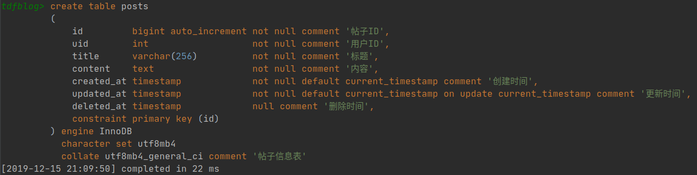
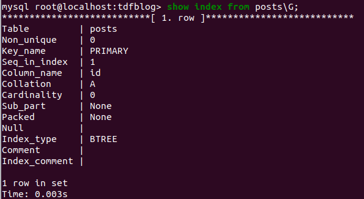
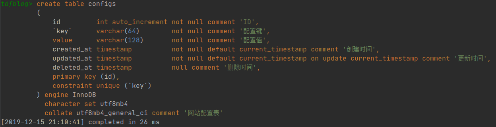
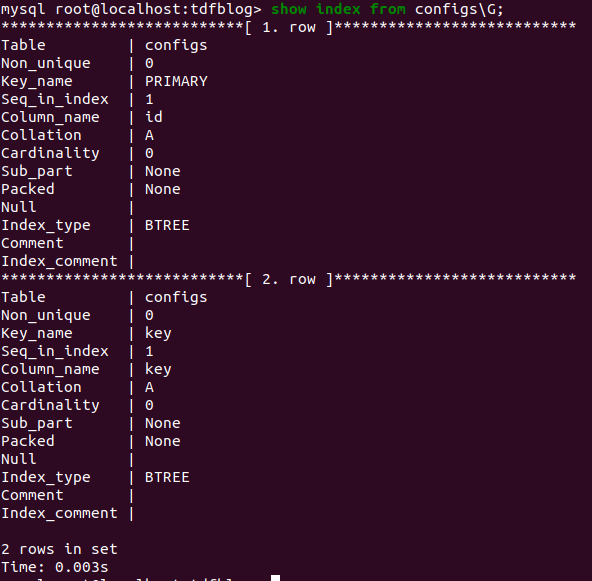

# MySQL的KEY和INDEX的区别

对于MySQL中的key和index区别，在官方的文档中给出了一句概括的说明。

> KEY is normally a synonym for INDEX.
The key attribute PRIMARY KEY can also be specified as just KEY when given in a column definition.
This was implemented for compatibility with other database systems.

翻译成中文，最为核心的就是：key一般情况下就是index的同义词。也就是说我们可以认为index和key表达的是相同的意思。
通过观察`tdfblog`数据库中的`users`，`posts`和`configs`表的创建，我们可以清楚的发现key和index的可相互替代性。

- users表创建

    ```sql
    create table users
    (
        id int auto_increment key not null comment '用户ID',
        nickname varchar(64) unique not null comment '昵称',
        avatar varchar(256) null comment '头像url',
        created_at timestamp not null default current_timestamp comment '创建时间',
        updated_at timestamp not null default current_timestamp on update current_timestamp comment '更新时间',
        deleted_at timestamp null comment '删除时间'
    ) engine InnoDB character set utf8mb4 collate utf8mb4_general_ci comment '用户信息表';
    ```

    执行结果如下：
    

    查看索引：
    

    错误的情况：
    

    > 通过上面的sql，对比可以发现`key`和`primary key`的含义重复。都表示主键，所以sql的执行结果会报错。当使用`key`和 `unique`也正常的生成了索引。

- posts表创建

    ```sql
    create table posts
    (
        id bigint auto_increment not null comment '帖子ID',
        uid int not null comment '用户ID',
        title varchar(256) not null comment '标题',
        content text not null comment '内容',
        created_at timestamp not null default current_timestamp comment '创建时间',
        updated_at timestamp not null default current_timestamp on update current_timestamp comment '更新时间',
        deleted_at timestamp null comment '删除时间',
        constraint primary key (id)
    ) engine InnoDB character set utf8mb4
        collate utf8mb4_general_ci comment '帖子信息表';
    ```

    执行结果如下：
    

    查看索引：
    

    > 通过上面的sql，可以发现`constraint primary key`和`primary key`的作用是一样的。

- configs表创建

    ```sql
    create table configs
    (
        id int auto_increment not null comment 'ID',
        `key` varchar(64) not null comment '配置键',
        value varchar(128) not null comment '配置值',
        created_at timestamp not null default current_timestamp comment '创建时间',
        updated_at timestamp not null default current_timestamp on update current_timestamp comment '更新时间',
        deleted_at timestamp null comment '删除时间',
        primary key (id),
        constraint unique (`key`)
    ) engine InnoDB character set utf8mb4
        collate utf8mb4_general_ci comment '网站配置表';
    ```

    执行结果如下：
    

    查看索引：
    

    > 通过对比上面的sql，可以发现`constraint unique key`和`unique key`的作用是一样的。

综合上面三张表的例子，可以确定在mysql的index和key一般情况下是等价的，相互之间可以替换。
虽然在`primary key`一般不会去使用index替换key，但是这里更多的是语法层面的考虑，而不是语义上的严格区分。
